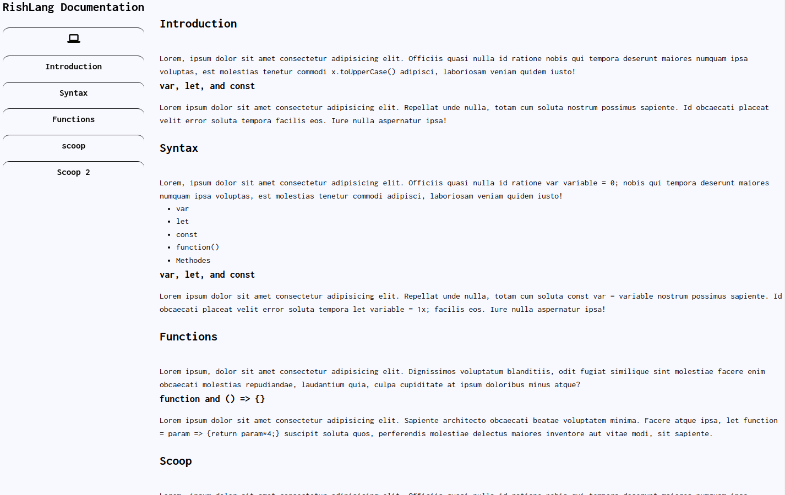
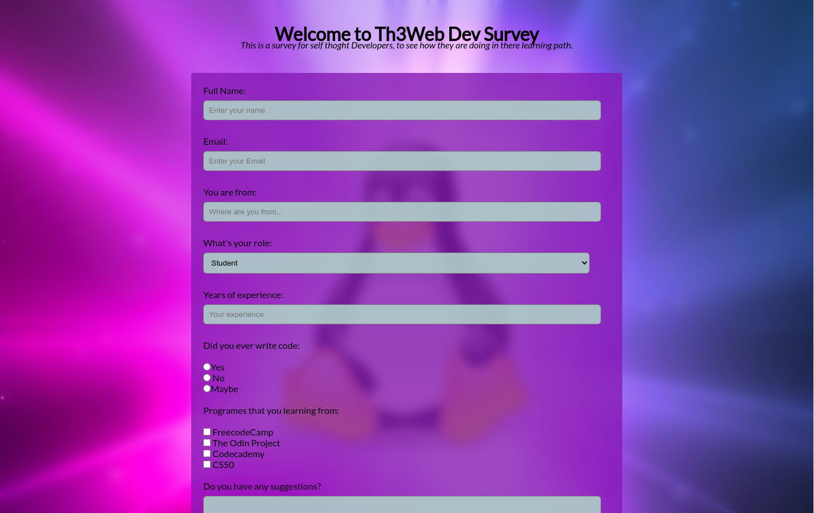
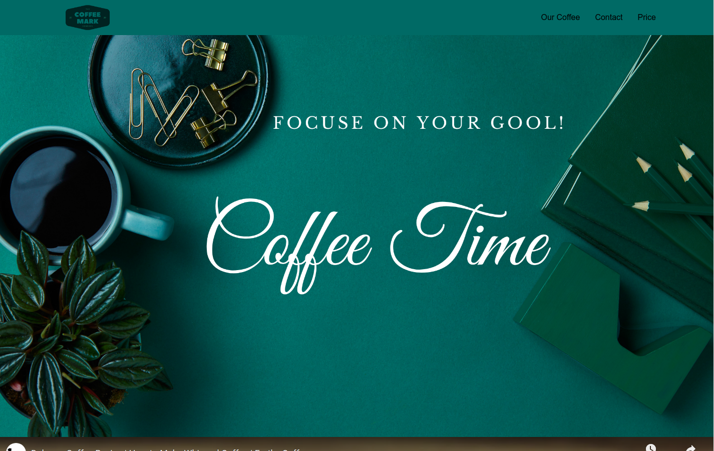
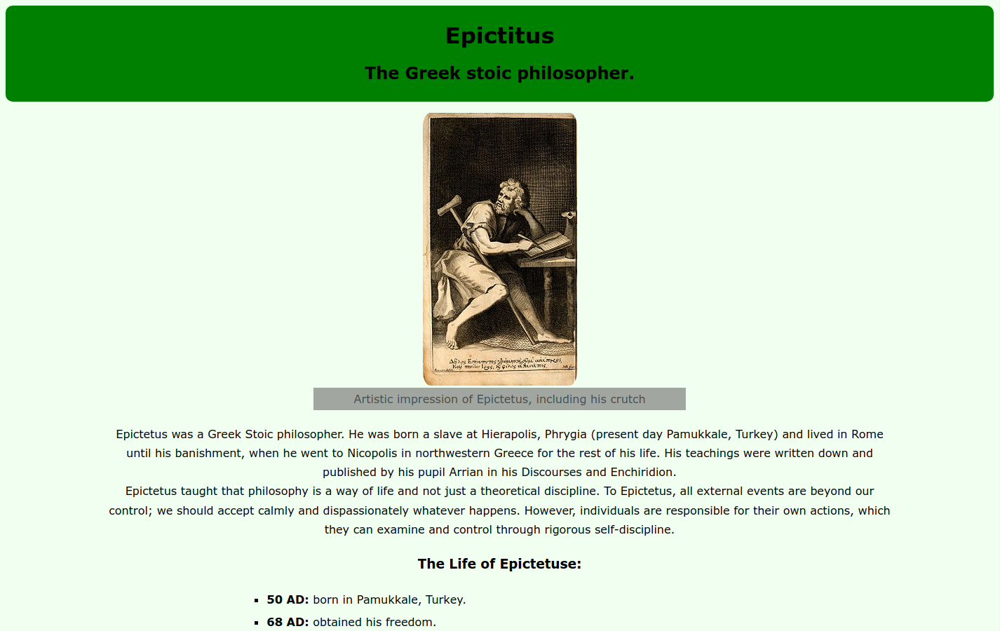

# Freecodecamp Projects

> This repo contain the five project in the freecodedcamp responsive design

## Screenshot

## Built With

- HTML
- CSS
- FlexBox
- Grid
- Github Pages

## Getting Started

To get a local copy up and running follow these simple example steps.

- copy the repo URL
- $ git clone (repo URL)

## Author

- GitHub: [@ismailco](https://github.com/Ismailco)
- Twitter: [@ismailcourr](https://www.twitter.com/ismailcourr)
- LinkedIn: [ismailcourr](https://www.linkedin.com/in/ismailcourr/)
- My Website: [ismailcourr.ml](https://www.ismailcourr.ml)

## 🤝 Contributing

if you have any ideas to add to the project Please let me know

## Show your support

Give a ⭐️ if you like this project!
